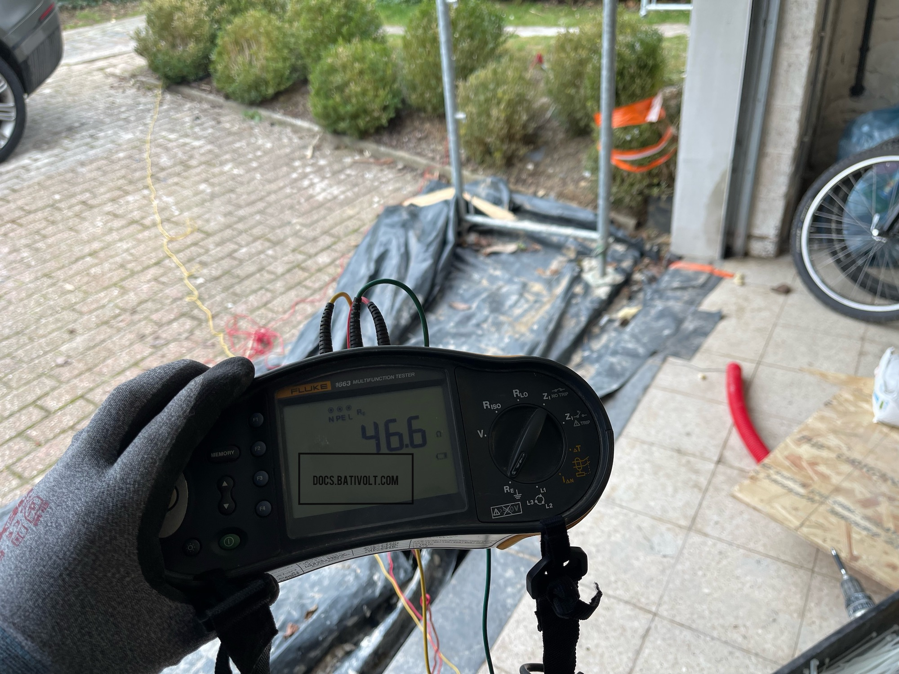
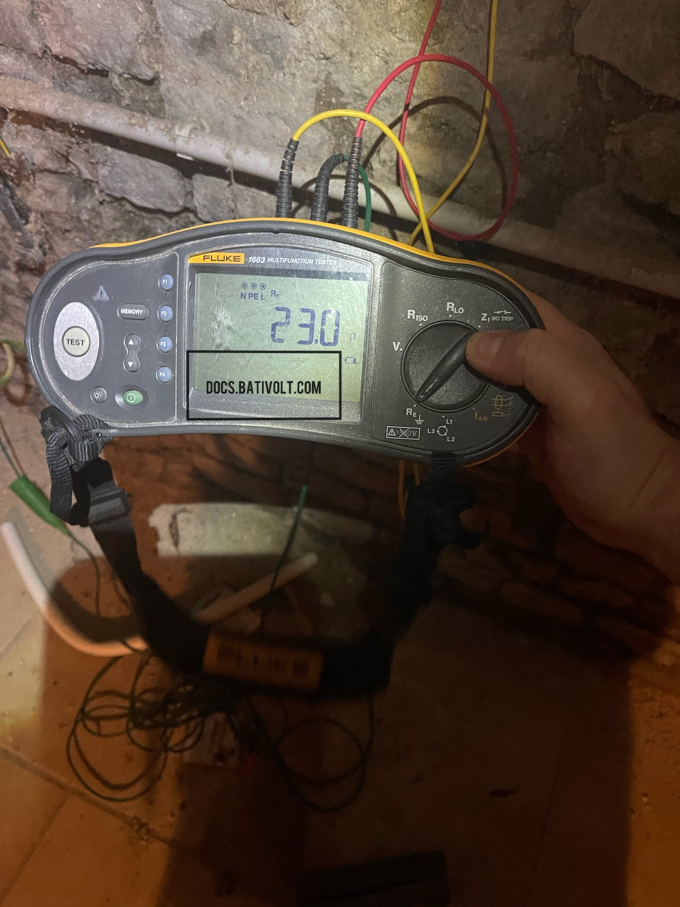

# Test de Résistance de Terre : Procédure et Exigences

## Introduction

Tester la résistance de terre est une étape essentielle pour garantir la sécurité des installations électriques. Les tests permettent de s'assurer que la mise à la terre est conforme aux normes réglementaires, limitant ainsi les risques de chocs électriques et de dysfonctionnements. Ce guide explique comment effectuer un test de résistance de terre, comment interpréter les résultats, et fournit des informations sur les coûts et le matériel requis.

> **Exemple :** Voici deux résultats de test de résistance de terre avec un **testeur Fluke 1663** :
>
> - **Non Conforme** : 46,6 ohms (au-dessus de la norme)
> - **Conforme** : 23 ohms (en dessous de la limite de 30 ohms)

### Images : Résultats de test de résistance de terre
> **Exemple :** Voici deux résultats de test de résistance de terre avec un **testeur Fluke 1663** :
>
> - **Non Conforme** : 46,6 ohms (au-dessus de la norme)

> - **Conforme** : 23 ohms (en dessous de la limite de 30 ohms)

## 1. Pourquoi Tester la Résistance de Terre ?

La résistance de terre garantit que les courants de défauts peuvent être évacués vers le sol en toute sécurité. Une valeur inférieure à 30 ohms est généralement exigée pour protéger les utilisateurs et l'équipement. 

:::info
**Note :** Tester régulièrement la résistance de terre permet de s'assurer que le système de mise à la terre fonctionne correctement et qu'il reste conforme aux normes.
:::

## 2. Matériel Nécessaire : Testeur de Résistance de Terre

Le **testeur de résistance de terre** est un outil essentiel pour vérifier la sécurité et la conformité d'une installation. Bien qu’un modèle comme le **Fluke 1663** soit souvent utilisé, d’autres appareils peuvent également être employés pour des mesures précises de la résistance de terre.

### Fonctionnement et Utilisation

1. **Préparation** : Connectez le testeur aux électrodes de test et aux piquets de terre.
2. **Mise en place des Piquets** : Enfoncez les piquets de terre dans le sol à une distance spécifique de la prise de terre principale.
3. **Test** : Le testeur applique une tension et mesure le courant, calculant ainsi la résistance selon la loi d'Ohm.

> **💡 Astuce :** Utilisez un marteau ou une masse pour enfoncer les piquets de terre. Cela garantit une bonne connexion avec le sol pour des résultats précis.

### Alternatives : Utiliser un Marteau-Piqueur pour l’Installation des Piquets de Terre

Il est également possible d’utiliser un **marteau-piqueur** avec un embout spécial pour faciliter l’installation des piquets, surtout si le sol est dur. Cet embout s’adapte à la tête du piquet et permet de l’enfoncer rapidement et uniformément dans le sol, sans endommager le piquet.

#### Exemple d’image : Utilisation d’un marteau-piqueur avec embout pour enfoncer un piquet de terre
:::info Image d'Exemple 📸

Une photo illustrative sera ajoutée ici prochainement. Vu l'ampleur de la documentation, il peut y avoir des sections en attente de visuels.

Si vous souhaitez aider la communauté, vous pouvez contribuer avec une photo personnelle en lien avec cette section ! Envoyez-la à [docs@bativolt.com](mailto:docs@bativolt.com), et nous l'intégrerons en mentionnant votre nom en tant que contributeur. Ensemble, enrichissons l’expérience éducative de Bativolt !

:::

## 3. Procédure de Test : Étape par Étape

### 3.1. Préparation du Site

1. **Débarrasser le sol** : Assurez-vous que le sol autour du piquet est dégagé de tout débris ou de matériau isolant.
2. **Distance des Piquets** : Placez les piquets à une distance spécifique (minimum de 2 mètres entre les piquets) pour obtenir une mesure précise.

### 3.2. Configuration du Testeur

1. **Brancher les Fils** : Connectez les câbles du testeur Fluke 1663 aux bornes de la terre et des piquets.
2. **Choisir le Mode de Test** : Réglez le testeur sur le mode de test de résistance de terre.

### 3.3. Lecture et Interprétation des Résultats

- **Résultat Conforme** : En dessous de 30 ohms, la résistance est adéquate.
- **Résultat Non Conforme** : Au-dessus de 30 ohms, des améliorations sont nécessaires pour garantir la sécurité.

:::caution
**Attention :** Si les résultats sont non conformes, il peut être nécessaire d’ajouter des piquets ou d'améliorer le contact avec le sol.
:::

## 4. Coûts Associés

Le coût d’un test de résistance de terre dépend du matériel, du temps nécessaire et des frais de main-d’œuvre si effectué par un professionnel.

### 4.1. Location de Matériel

- **Location du Testeur Fluke 1663** : Environ 50 à 100 € par jour.
- **Achat du Testeur Fluke 1663** : Entre 800 et 1200 €, selon les options.
  
### 4.2. Installation et Matériel Supplémentaire

- **Piquets de Terre** : Environ 10 à 30 € par piquet.
- **Câbles de Connexion** : Variable selon la longueur nécessaire, de 5 à 20 €.

### 4.3. Intervention Professionnelle

Faire appel à un électricien pour réaliser le test peut coûter entre 100 et 200 €, incluant le déplacement, la main-d'œuvre, et l’utilisation du matériel professionnel.

## 5. Méthode de Calcul : La Loi d’Ohm

Le testeur utilise la loi d’Ohm pour calculer la résistance : **R = V/I**, où :
- **R** est la résistance de terre (en ohms),
- **V** est la tension appliquée,
- **I** est le courant mesuré.

> **Exemple :** Si le testeur applique une tension de 10 volts et que le courant mesuré est de 0,5 ampères, alors la résistance est de **R = 10 / 0,5 = 20 ohms**.

:::tip
**Conseil :** Vérifiez plusieurs points autour du piquet pour vous assurer que les valeurs sont cohérentes. Les variations peuvent indiquer des problèmes avec le sol ou les piquets.
:::

## Conclusion

Assurer une résistance de terre conforme est essentiel pour la sécurité des installations électriques. En cas de doute, ou si les résultats sont non conformes, il est fortement recommandé de consulter un professionnel. La mise en conformité des systèmes de mise à la terre permet de prévenir des risques potentiels et de garantir la sécurité des utilisateurs.

> **Rappel :** Tester la résistance de terre est indispensable pour toute installation, qu'elle soit nouvelle ou ancienne. Des valeurs conformes garantissent une protection efficace contre les défaillances électriques.

---

**Disclaimer :**  
Les contenus de ce site, docs.bativolt.com, sont fournis par Bativolt, entreprise d'électricité agréée. Destinés à un usage éducatif, ils reposent sur notre interprétation et notre expérience avec le Règlement Général sur les Installations Électriques (RGIE). Bativolt ne peut être tenu responsable d'un mauvais usage ou d'une interprétation erronée du RGIE ou de notre documentation.

**Copyright © {new Date().getFullYear()} Bativolt. Tous droits réservés.**  
La reproduction, même partielle, du contenu de ce site est interdite sans autorisation préalable.

---
