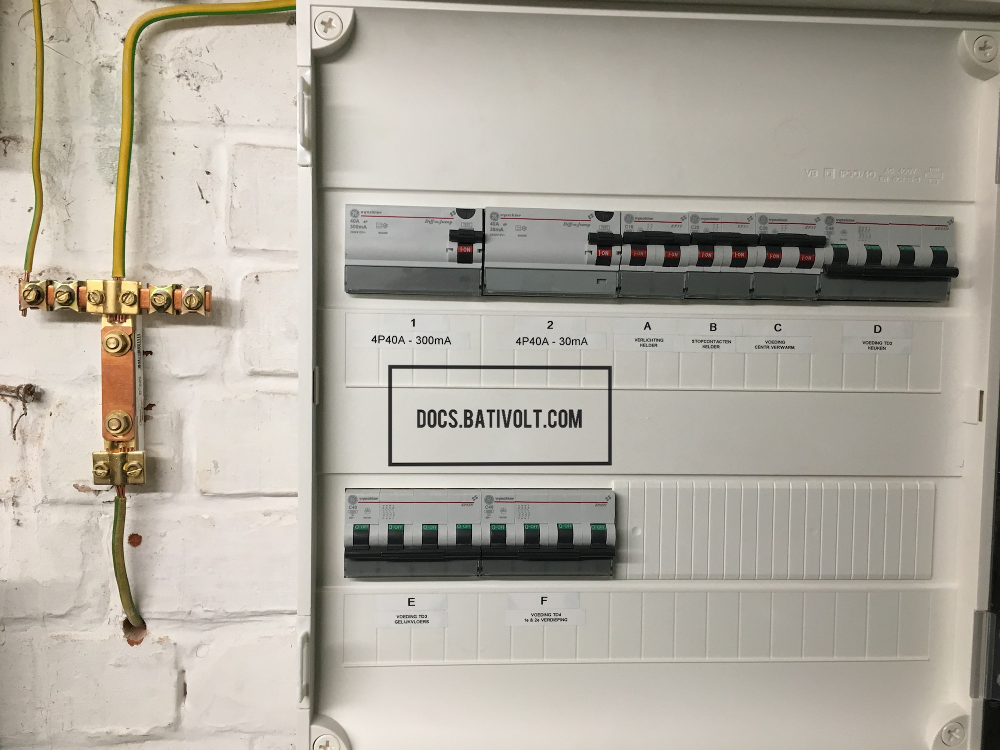

# Tableaux Électriques Non Conformes

## Introduction

Les tableaux électriques jouent un rôle crucial dans la sécurité des installations. Ils distribuent l'électricité dans les différents circuits de l'habitation ou du bâtiment et protègent les utilisateurs contre les surcharges et les courts-circuits. Toutefois, de nombreux tableaux en circulation ne sont pas conformes aux normes actuelles, créant des risques pour la sécurité.

> **⚠️ Avertissement :** Un tableau non conforme peut engendrer des risques d'incendie et compromettre la sécurité des utilisateurs. La mise en conformité est donc essentielle.

## 1. Importance des Tableaux Électriques

### 1.1. Distribution Électrique

Le tableau électrique est le point central de distribution de l'électricité dans une installation. Il dirige l’énergie vers les différents circuits (éclairage, prises de courant, appareils électroménagers) et assure une alimentation efficace.

:::info
**Astuce :** Une configuration bien structurée dans le tableau électrique facilite les interventions et améliore la gestion de l'énergie.
:::

### 1.2. Protection des Circuits

Les tableaux doivent être équipés de **disjoncteurs** et de **fusibles** pour couper l’électricité en cas de surcharge ou de court-circuit. Ces dispositifs sont essentiels pour prévenir les incendies et protéger les occupants.

> **💡 Note :** Les disjoncteurs modernes permettent une remise en service rapide après un incident, contrairement aux fusibles qui nécessitent un remplacement complet.

## 2. Disjoncteurs vs Anciens Fusibles

### 2.1. Disjoncteurs

Les disjoncteurs modernes sont conçus pour interrompre automatiquement le courant en cas de surcharge ou de court-circuit. Ils sont plus fiables que les fusibles, car ils peuvent être réenclenchés après un déclenchement.

#### 2.1.1. Types de Disjoncteurs

- **Disjoncteurs Thermomagnétiques** : Protègent contre les surcharges et les courts-circuits.
- **Disjoncteurs Différentiels** : Protègent contre les fuites de courant à la terre, réduisant le risque d'électrocution.

> **💡 Conseil :** Assurez-vous de bien distinguer les types de disjoncteurs, car chacun a un rôle spécifique dans la sécurité de l'installation.

### 2.2. Anciens Fusibles

Les anciens fusibles, courants dans les installations plus anciennes, ne garantissent pas le même niveau de protection que les disjoncteurs modernes. Lorsqu'un fusible fond en cas de surcharge, il doit être remplacé, ce qui prend du temps.

:::caution
**Attention :** Il est recommandé de remplacer les anciens fusibles par des disjoncteurs modernes pour améliorer la sécurité de l’installation et la remettre aux normes.
:::

## 3. Risques Associés à un Tableau Électrique Non Conforme

### 3.1. Risque d'Incendie

Un tableau électrique non conforme augmente le risque d’incendie. Les installations obsolètes avec des fusibles usés ou des disjoncteurs défectueux peuvent surchauffer et provoquer des départs de feu.

> **⚠️ Avertissement :** Des câbles mal dimensionnés ou dégradés dans un tableau non conforme amplifient les risques d'incendie. Une inspection régulière est cruciale pour éviter ces dangers.

### 3.2. Non Coupure des Phases

Dans certains tableaux, les phases ne se coupent pas simultanément en cas de dysfonctionnement. Cela peut provoquer des déséquilibres et des surchauffes, menaçant la sécurité des équipements et des utilisateurs.

### 3.3. Surtensions

Les tableaux électriques doivent pouvoir gérer les surtensions. Sans protection adéquate, comme un parafoudre, les équipements branchés risquent d’être endommagés.

:::tip
**Astuce Sécurité :** Installez un parafoudre pour protéger votre équipement contre les surtensions. Cela est particulièrement utile dans les régions sujettes aux orages.
:::

### 3.4. Non-Conformité Réglementaire

Selon l'article **4.2.4** du RGIE, toutes les installations électriques doivent être équipées de dispositifs de protection conformes aux normes en vigueur. Un tableau non conforme expose à des sanctions lors des contrôles de conformité.

> **Note :** La mise en conformité de votre tableau est une obligation légale et un gage de sécurité pour vous et vos proches.

## 4. Équipements et Matériel à Prévoir

### 4.1. Disjoncteurs

La mise en conformité d'un tableau électrique nécessite des disjoncteurs modernes, incluant des disjoncteurs thermiques et différentiels adaptés aux besoins de l'installation.

:::info
**Exemple :** Un disjoncteur différentiel protège contre les fuites de courant et est particulièrement recommandé dans les pièces humides.  
:::

### 4.2. Parafoudres

Les parafoudres protègent les appareils contre les surtensions. Pour une protection optimale, ils doivent être installés à proximité du tableau.

> **Conseil :** Un parafoudre de qualité réduit les risques de dommages aux équipements en cas de surtension, augmentant ainsi leur durée de vie.

### 4.3. Coût des Matériaux

Le coût de remplacement d’un tableau électrique non conforme varie selon le type de matériel nécessaire et la complexité de l’installation. Voici une estimation :

- **Disjoncteurs** : Entre 15 et 50 € par unité, selon le type et la capacité.
- **Parafoudres** : Entre 100 et 200 €, en fonction de l’installation.
- **Installation Complète du Tableau** : Entre 500 et 1500 €, selon les besoins spécifiques.

:::tip
**Budget Prévisionnel :** Demandez des devis auprès de professionnels pour une estimation précise des coûts liés à la mise en conformité de votre tableau.
:::

## Conclusion

Assurer la conformité des tableaux électriques est essentiel pour garantir la sécurité des utilisateurs. Les risques associés aux tableaux non conformes, comme les incendies et les surtensions, peuvent avoir des conséquences graves. Il est fortement recommandé de faire inspecter et, si nécessaire, de remplacer les tableaux par des professionnels qualifiés. 

> **Rappel :** Un tableau conforme est non seulement une obligation légale, mais aussi un élément essentiel pour la sécurité et la durabilité de votre installation électrique.

En résumé, la mise en conformité des tableaux électriques protège non seulement vos biens, mais surtout la sécurité des personnes. En cas de doute, consultez un professionnel qualifié pour évaluer et mettre à jour votre installation.

---

**Disclaimer :**  
Les contenus de ce site, docs.bativolt.com, sont fournis par Bativolt, entreprise d'électricité agréée. Destinés à un usage éducatif, ils reposent sur notre interprétation et notre expérience avec le Règlement Général sur les Installations Électriques (RGIE). Bativolt ne peut être tenu responsable d'un mauvais usage ou d'une interprétation erronée du RGIE ou de notre documentation.

**Copyright © {new Date().getFullYear()} Bativolt. Tous droits réservés.**  
La reproduction, même partielle, du contenu de ce site est interdite sans autorisation préalable.

---
